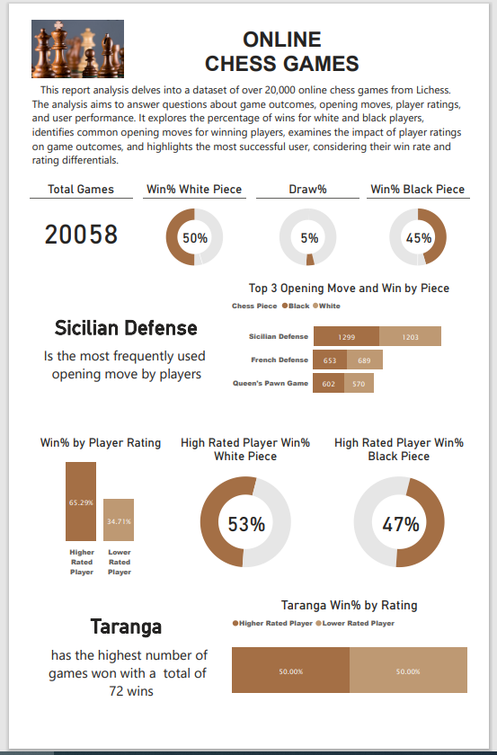

# 
 Online-Chess-Game-Analysis

## Project Overview

In the world of online chess enthusiasts, where strategic thinking meets competitive play, understanding game outcomes and opening move trends can unlock valuable insights for both players and platform administrators. With the extensive dataset provided by Lichess, a popular chess platform, we delve into captivating questions to cater to the needs of the chess-playing community and enhance the user experience.

1. **Analyzing Winning Patterns:**
   For the audience of chess players eager to refine their strategies, we investigate the following questions:
   - What percentage of games were won by white? How many ended in a draw?
   
2. **Opening Moves and Victory:**
   Appealing to chess enthusiasts aiming to enrich their repertoire of opening moves, we explore:
   - Which opening move was most frequently used in games in which black won? What about when white won?

3. **Rating Influence on Victory:**
   Targeting both competitive players and those who aspire to climb the rating ladder, we address:
   - What percentage of games are won by the player with the higher rating? Does this vary by piece color?

4. **Player Triumph and Rating Dynamics:**
   Focusing on player recognition and motivation, we inquire:
   - Which user won the most amount of games? In what percentage of those games was the user the higher-rated player?

The goal of this project is to unravel the intricacies of chess victories, explore the significance of opening moves, evaluate the impact of player ratings, and celebrate the accomplishments of outstanding users in the chess community. By providing data-driven insights, we empower chess aficionados to elevate their gameplay, foster a deeper understanding of strategic dynamics, and nurture a sense of community and achievement within the realm of online chess.

## Data source

The dataset  was downloaded from maven playground [click here](https://mavenanalytics.io/data-playground?order=-fields.dateAdded&page=7&pageSize=5)

## Data Exploration & cleaning
The dataset exploration was done with Excel Power Query
The dataset contains 20058 rows and 17 columns namely:
game_id, rated, turns, victory_status, winner, time_increment, white_id , white_rating, black_id, black_rating, moves, opening_code, opening_fullname, openingshortname, opening_response, and opening_variations.

opening_response has 18851 missing values.
opening_variations has 5660 missing values.

A new column called "winner" was created using the "IF()" function to return the colour of the chess piece that won and draw if the game ended in a draw.

## Analysis & Visualisation

# 
 

## Insight

-  50% of the games were won by White piece, 5% was drawn.

-  Sicilian Defense is the most commonly used opening move among players

-  A remarkable 65.29% of the won games were secured by higher-rated players.This suggests a strong correlation between player ratings and their success, shedding light on the role of skill and experience in chess outcomes.

-  Out of the games won by higher-rated players, 53% were achieved while playing as white pieces, while 47% were secured while playing as black pieces. This indicates a balanced proficiency of higher-rated players with both white and black pieces.

-  Taranga stands out with an impressive total of 72 games won, maintaining a 50% win ratio regardless of whether playing as a higher or lower-rated player. This consistency showcases Taranga's skill across different matchups and player ratings.
